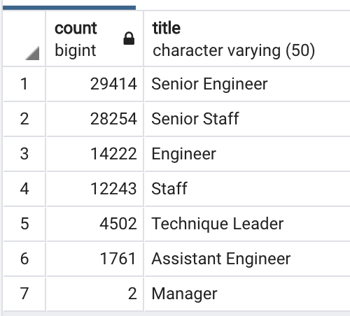
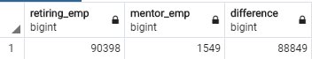
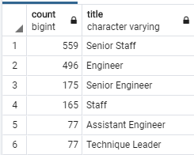

# Pewlett Hackard Analysis
## Overview of the Analysis
* The purpose of this analysis was to establish how many employees are reaching retiring age and what positions they are currently holding.
* Also to establish a table of employees who are eligible to participate in the mentorship program.
## Results
* Two job titles will have substantially more roles to fill; Senior Engineer (29414) and Senior Staff (28254)
* The job title with the fewest roles to fill will be Manager (2)
* The analysis shows that a majority of the positions within the company are currently held by employees born between 1952 and 1955.
* There is a drastic shortage of employees eligible for the mentorship program(1,549) compared to the number of employees retiring(90,398).

## Summary
* How many roles will need to be filled as the "silver tsunami" begins to make an impact?
  - As the retirement age employees begin to retire from the compnay there will be a total of 90,398 positions to fill.
* Are there enough qualified, retirement-ready employees in the departments to mentor the next generation of Pewlett Hackard employees?
  - The simple answer to the above question is yes, by a lot. As seen in the below table, there is a difference of 88,849 between employees retiring and employees eligible for the mentorship program.
  - Furthermore, there are enough employees retiring to help mentor eligible employees when broken down by job title as well.

